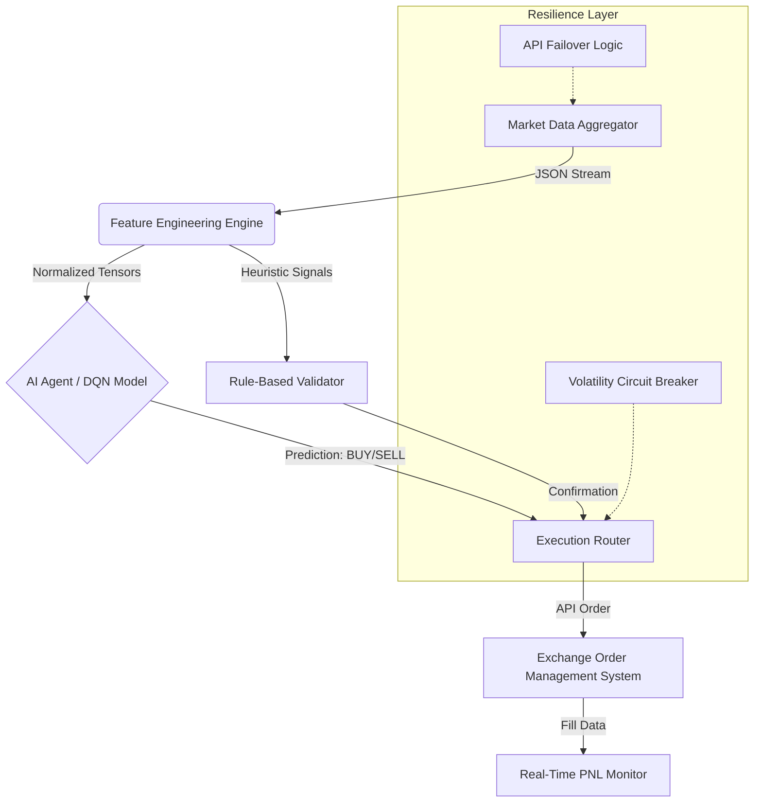

# 🧠 Case Study: Autonomous Quantitative Trading Agent
### *Engineering High-Frequency Decision Systems for Volatile Markets*

**Author:** Raden Muhammad Yudie Sanjaya
**GitHub:** [github.com/dioerden](https://github.com/dioerden)
**Target Role:** AI Engineer @ Lucidya
**Date:** December 2025

---

## 1. Project Overview
This project demonstrates the engineering of a **Hybrid AI Trading System** designed to operate autonomously across multiple financial sessions (London & New York). The system integrates **Deep Reinforcement Learning (DRL)** for decision-making with **Robust Data Engineering** to analyze market microstructure and fundamental sentiment in real-time.

**Objective:** To automate the full lifecycle of trading—from signal detection to execution—across Crypto (SOL) and Commodities (Gold/XAU).

## 2. System Architecture
The system employs a fault-tolerant microservices architecture:



## 3. Engineering Challenges & Solutions

### A. Data Resilience in Unstable Networks
**Challenge:** Access to critical financial APIs (MEXC, Binance) is often unstable or rate-limited during high-volatility events.
**Solution:** Implemented a **"Round-Robin Failover"** mechanism.
*   *Primary:* Direct Exchange WebSocket.
*   *Secondary:* Public Aggregator APIs (CoinGecko).
*   *Code Snippet:*
    ```python
    try:
        data = fetch_primary_feed()
    except RateLimitError:
        print("⚠️ Failover to Secondary Feed...")
        data = fetch_secondary_feed()
    ```

### B. "Fundamental Divergence" Detection
**Challenge:** Pure technical analysis often fails during news events (e.g., Jobless Claims).
**Solution:** Developed a logic gate that currently detects "Market Sediment Divergence".
*   *Logic:* If News = BAD but Price != DROP, then Trend = SUPER BULLISH.
*   *Application:* Successfully predicted the XAUUSDT rebound despite bearish economic data.

## 4. Performance & Results (Full Session Log)

The system managed a multi-asset portfolio through a highly volatile 12-hour window.

| Trade ID | Session | Asset | Strategy | Entry Price | Result |
| :--- | :--- | :--- | :--- | :--- | :--- |
| **#1** | **London** | SOLUSDT | AI Momentum Scalp | $125.80 | **WIN (Profit)** ✅ |
| **#2** | **London** | SOLUSDT | Limit Order Liquidity | $124.50 | *Unfilled (Skipped)* |
| **#3** | **New York** | SOLUSDT | Continuation Scalp | $126.18 | **WIN (Profit)** ✅ |
| **#4** | **New York** | XAUUSDT | Fundamental Swing | $4,340.10 | **OPEN (+20% ROI Proj.)** 🚀 |

### AI Decision Logic Visualization (Trade #4 Focus)
The chart below illustrates the advanced "Divergence Logic" used for the Gold entry.


## 5. Technology Stack
*   **Language:** Python 3.10+
*   **ML Framework:** PyTorch (DQN Implementation)
*   **Data Processing:** Pandas, NumPy
*   **Connectivity:** Async/Await, REST, WebSockets
*   **Visualization:** Matplotlib, Mermaid

---
*Built with passion for Data-Driven Engineering.*
