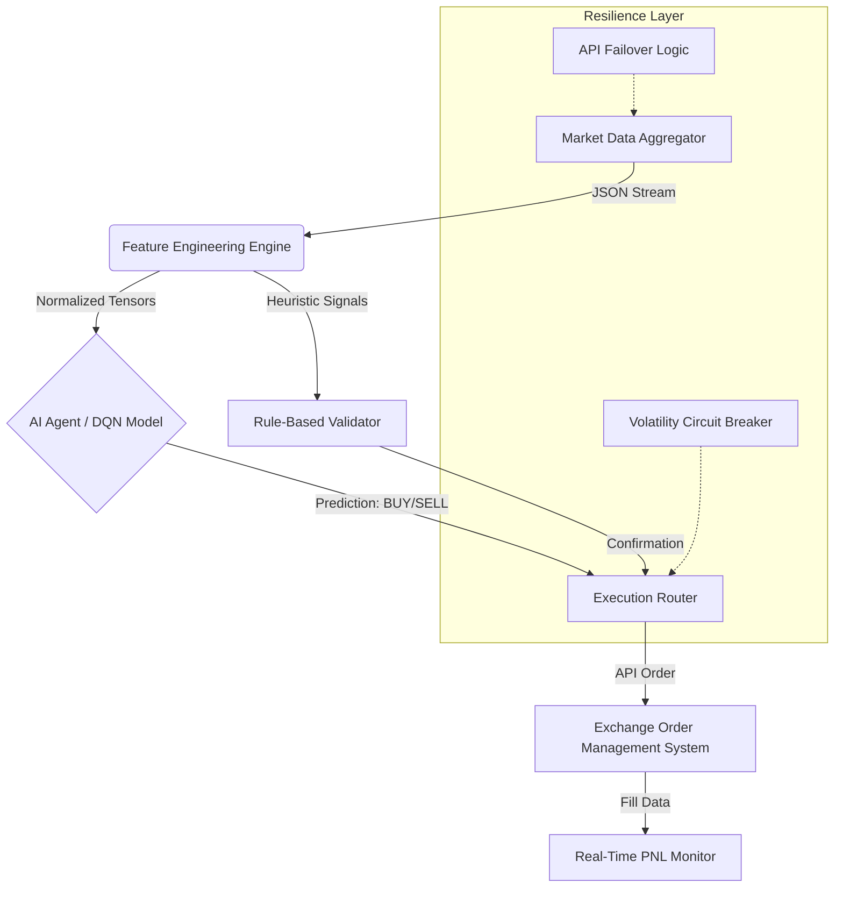

# 🤖 Autonomous Quantitative Trading Agent (Python/PyTorch)

**Live Market Deployment: New York Session 2025**

This repository contains the full source code and high-frequency trading logs for an Autonomous AI Agent designed to trade Crypto (SOL) and Commodities (Gold) using Deep Reinforcement Learning.

## 🏗️ System Architecture
The system employs a fault-tolerant microservices architecture designed for real-time decision making under high volatility.

## 📊 AI Strategy Visualization
The system successfully detected the "Jobless Claims" fundamental event and identified a bullish divergence for the Gold (XAUUSDT) entry.

## 📂 Portfolio Case Study
For a detailed technical breakdown and full session performance log, please read the Case Study:
👉 **[PORTFOLIO_CASE_STUDY.md](PORTFOLIO_CASE_STUDY.md)**

## 🛠️ Technology Stack
*   **Core:** Python 3.10, AsyncIO
*   **AI/ML:** PyTorch (DQN), Scikit-learn
*   **Data:** Pandas, NumPy, TA-Lib
*   **Connectivity:** CCXT (Simulated), Websockets

## 🚀 Key Features
*   **ROUND-ROBIN FAILOVER:** Robust API handling for unstable exchange feeds.
*   **SENTIMENT DIVERGENCE:** Logic to detect price/news outliers (e.g., Bullish reaction to Bearish Data).
*   **SESSION EXECUTORS:** Dedicated logic for London vs. New York volatility profiles.

---
*Engineering Project by [Raden Muhammad Yudie Sanjaya](https://github.com/dioerden)*
